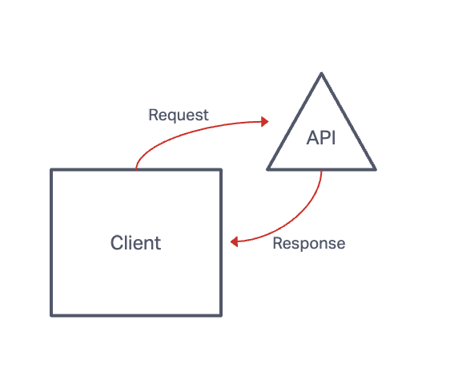
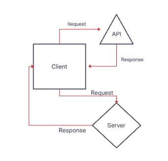
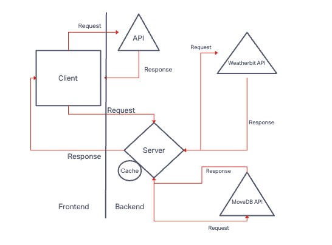

# City-Explorer

Name of feature: ___Advanced Topics__________

Estimate of time needed to complete: _4hrs____

Start time: _2:30 pm____

Finish time: _4:30 pm____

Actual time needed to complete: _2 hrs____

**Author**:  Tiffani Rice

**Version**: 1.0.0 

## Overview
A website that allows users to see realtime weather, map, and movie information simply by typing in the name of a city. This application used advanced APIs and a caching support feature.

## Getting Started

Def started it like the Black Eyed Peas.

## Architecture

Javascript components that get data from storage

## Change Log

WWRC

## Credit and Collaborations
Anthony Sinitsa, Tony Regalado
